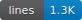
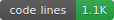

# Promotibot





A Discord bot for managing user ranks and promotions within your server. Easily create a rank hierarchy and promote/demote members through simple slash commands.

## Features

- **Discord Role Integration** - Uses existing Discord roles as ranks
- **Automatic Role Assignment** - Promotes/demotes automatically assign the correct role
- **Custom Rank Hierarchy** - Create your own ranking system from lowest to highest
- **Easy Promotions** - Promote users with a single command
- **Detailed Stats** - View user rank statistics with progress bars and history
- **Leaderboard** - See who's climbing the ranks fastest
- **Persistent Data** - All data is saved and persists across bot restarts

## Commands

### General Commands
| Command | Description |
|---------|-------------|
| `/rank [user]` | View rank stats for yourself or another user |
| `/ranks` | View all configured ranks for the server |
| `/leaderboard [limit]` | View the top ranked members |
| `/help` | Show all available commands |

### Promotion Commands (Requires Manage Roles permission)
| Command | Description |
|---------|-------------|
| `/promote <user>` | Promote a user to the next rank |
| `/demote <user>` | Demote a user to the previous rank |
| `/setrank <user> <rank>` | Set a user to a specific rank |
| `/resetuser <user>` | Remove a user from the ranking system |

### Admin Commands (Requires Administrator permission)
| Command | Description |
|---------|-------------|
| `/setranks <roles>` | Set up the rank hierarchy using Discord roles (comma-separated, lowest to highest) |
| `/addrank <role> [position]` | Add a Discord role to the hierarchy |
| `/removerank <rank>` | Remove a rank from the hierarchy |

## Getting Started

### Prerequisites
- [Node.js](https://nodejs.org/) v16.9.0 or higher
- A Discord Bot Token from the [Discord Developer Portal](https://discord.com/developers/applications)

### Installation

1. **Clone the repository**
   ```bash
   git clone https://github.com/NagusameCS/Promotibot.git
   cd Promotibot
   ```

2. **Install dependencies**
   ```bash
   npm install
   ```

3. **Configure the bot**
   - Copy `.env.example` to `.env`
   - Fill in your bot credentials:
     ```env
     DISCORD_TOKEN=your_bot_token_here
     CLIENT_ID=1450698323240554548
     GUILD_ID=your_test_server_id  # Optional, for faster dev deployment
     ```

4. **Deploy slash commands**
   ```bash
   npm run deploy
   ```

5. **Start the bot**
   ```bash
   npm start
   ```

### Bot Permissions

When inviting the bot to your server, ensure it has these permissions:
- Read Messages/View Channels
- Send Messages
- Embed Links
- Use Slash Commands

**Invite URL:**
```
https://discord.com/api/oauth2/authorize?client_id=1450698323240554548&permissions=2147485696&scope=bot%20applications.commands
```

## Usage Example

1. **Set up your ranks** (Admin only):
   ```
   /setranks Recruit, Member, Veteran, Elite, Champion, Legend
   ```

2. **View the rank hierarchy**:
   ```
   /ranks
   ```

3. **Promote a member**:
   ```
   /promote @username
   ```

4. **Check someone's stats**:
   ```
   /rank @username
   ```

5. **View the leaderboard**:
   ```
   /leaderboard
   ```

## Project Structure

```
Promotibot/
├── src/
│   ├── commands/          # Slash command files
│   │   ├── addrank.js
│   │   ├── demote.js
│   │   ├── help.js
│   │   ├── leaderboard.js
│   │   ├── promote.js
│   │   ├── rank.js
│   │   ├── ranks.js
│   │   ├── removerank.js
│   │   ├── resetuser.js
│   │   ├── setrank.js
│   │   └── setranks.js
│   ├── database.js        # Data persistence layer
│   ├── deploy-commands.js # Command deployment script
│   └── index.js           # Main bot entry point
├── data/                  # Stored rank and user data (auto-generated)
├── .linehook/             # Code statistics badges
├── .env.example           # Environment variable template
├── .gitignore
├── package.json
└── README.md
```

## Development

For development, you can use the combined deploy and start command:
```bash
npm run dev
```

Set the `GUILD_ID` in your `.env` for faster command registration during development (guild commands update instantly, global commands take up to 1 hour).

### Updating Stats

This project uses [LineHook](https://github.com/NagusameCS/lineHook) for code statistics badges.

```bash
# Update badges
linehook badge --save

# Commit updated badges
git add .linehook/ && git commit -m "Update stats"
```

## License

This project is licensed under the ISC License - see the [LICENSE](LICENSE) file for details.

## Contributing

Contributions are welcome! Feel free to open an issue or submit a pull request.

---

Made for Discord communities
